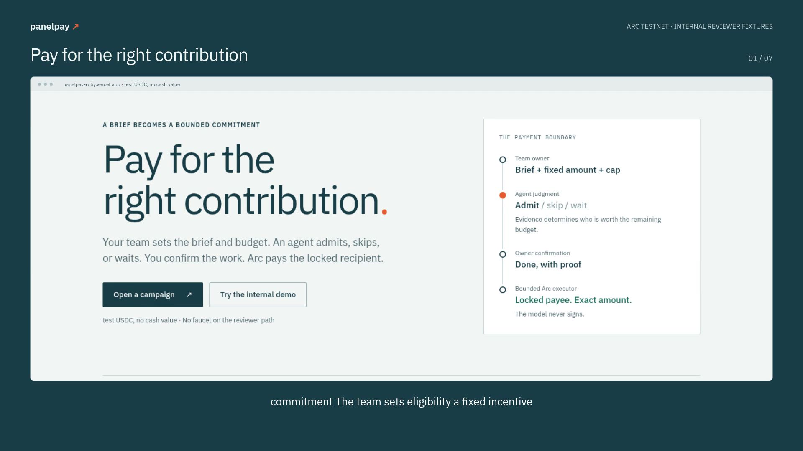

# PanelPay narrated demo

Editable Remotion walkthrough of the real Arc testnet rail. Every applicant and campaign shown is an internal reviewer fixture. No independent traction is claimed. Test USDC has no cash value.

The application screens come from actual browser actions and real testnet transactions, with no intercepted wallet or RPC responses. The framing and cuts use PanelPay's own branding and the established Outlay delivery workflow.

Render with `npm ci` then `npm run render`. Regenerate narration using `python3 tools/voiceover.py` (edge-tts and FFmpeg required). Source screens, narration, subtitles, transcript, and scene timeline are preserved for editing.

Verification and public payment proof are recorded in `../proof/`.

[Watch/download the MP4](https://raw.githubusercontent.com/dmetagame/panelpay/main/demo-video/panelpay-demo.mp4) · [Subtitles](panelpay-demo.srt) · [Transcript](transcript.txt)

The final walkthrough is 2:02 at 1920×1080 / 30 fps, H.264 video and AAC narration. Application captures come from the successful public browser run recorded in `evidence.json`. Crop coordinates are preserved in `public/screens/manifest.json`; the receipt scene pans to the transaction evidence. `verification.json` records encoding, complete decode, scene timing, sampled frames, and the file hash.

